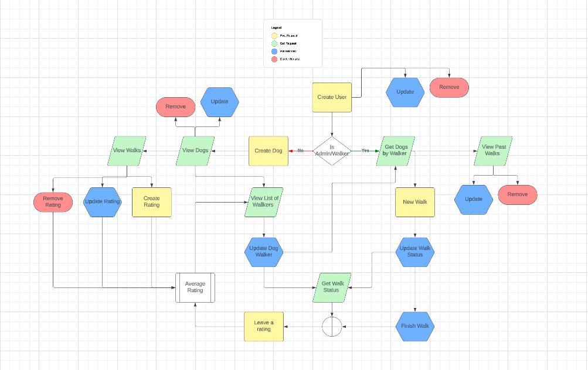

# **The Walking Dawg App**


Welcome to our Project. The Walking Dawg is an application designed to help connect dog owners with dog walkers. With this app, they would be able to easily set up an appointment to have their dog(s) walked. 


 You might be wondering what led us to create The Walking Dawg app. Well, we are a team of three that are enrolled in a Software Development bootcamp (Eleven Fifty Academy). Our group project requirement was to come up with an idea for a .NET Framework API web application using n-tier architecture where each member of the team  had at least one custom data table that they were responsible for. This application is a complilation of all that we have learned in 10 weeks of this course.  Enjoy! 


## Features
- Lets users set an appointment to have their dog(s) walked
- The user has the ablility to choose from a list of available dog walkers
- The site has an option for users to be able to leave a rating for the walker
- Can view walk status for dog(s)
- Dog walkers can create a walk
-Dog walkers have ability to update walk status and show when finished
-Dog Walkers can view past walks

**Flow-Chart of Endpoints**




## Getting Started
You will need to make sure you have .Net SDK installed -> [.NET SDK](https://dotnet.microsoft.com/download)


To clone The Walking Dawg App repository, use this link ->

```shell
git clone https://github.com/jacksonlee1/TheWalkingDawg.git
```

## Usage
(Here we will add some screen shots and provide further instruction. Users can reference this so know what can expect)

## Credits 
(list team names and include links to each of our github repos)